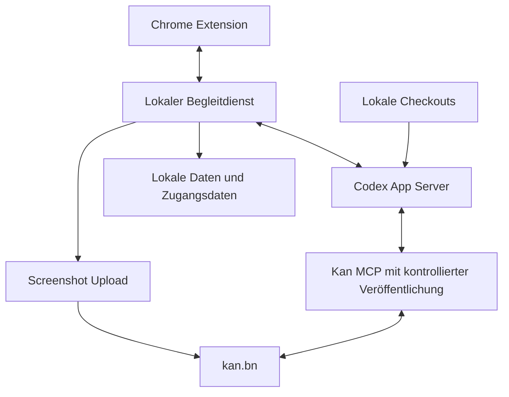

# Designdokument für Website Reviews mit Chrome Codex und kan.bn

Dieses Design legt den MVP für persönliche Website Reviews im internen Team fest. Kommentare aus Chrome werden mit Bildkontext und lokal untersuchtem Projektcode aufbereitet und als Tickets in kan.bn gespeichert. Der Schwerpunkt liegt auf einem schnellen Review und verlässlicher Veröffentlichung.

## Ziel und Umfang

Ein internes Team soll Produktwünsche und visuelle Korrekturen direkt auf Dev- und Staging-Seiten erfassen und daraus verständliche Tickets in kan.bn erstellen. Die Chrome-Extension sammelt persönliche Kommentare und Bildkontext. Ein lokaler Begleitdienst verbindet sie mit Codex, das im zugeordneten Checkout nach belegbaren Fundstellen sucht und über MCP Tickets verarbeitet.

Das Dokument beschreibt den vereinbarten MVP und dient als Grundlage für Umsetzung und Review. Stand: 30. September 2026. Die Produktentscheidungen stammen aus der gemeinsamen Klärung. Konkrete Datenstrukturen, Oberfläche und Integrationsmechanismen sind technische Vorschläge, soweit nicht ausdrücklich als verbindlich bezeichnet.

Der erste Praxistest umfasst einen Review mit ungefähr zehn Kommentaren. Bewertet werden die Qualität der Tickets ohne Textkorrektur, notwendige Rückfragen und der Zeitaufwand gegenüber dem bisherigen Ablauf.

## Verbindliche Produktentscheidungen

| Bereich | Festlegung |
| --- | --- |
| Nutzer | Internes Team; Kommentare und Markierungen sind persönlich. |
| Einsatz | Eigene Dev- und Staging-Seiten; kein Einbau von Code in die geprüfte Anwendung. |
| Plattform | Chrome; lokaler Begleitdienst zunächst für Unix-Systeme. |
| Feedback | Elementmarkierung, freie Position und allgemeiner Seitenkommentar. |
| Kontext | Screenshot der sichtbaren Seite mit Markierung, URL, Fenstergröße und Text des ausgewählten Elements. Zuschneiden vor der Übergabe; weiterer Seiteninhalt nur gezielt. |
| Projekt | Mehrere explizite Adressregeln mit optionalem Port und Pfad. Bei Mehrdeutigkeit wählt der Nutzer das Projekt. |
| Zusammenarbeit | Projektconfig per Export und Import; keine automatische Synchronisierung im MVP. |
| Lokale Zuordnung | Jedes Teammitglied ordnet eigene Projektordner zu. Zugangsdaten und lokale Pfade werden nicht exportiert. |
| Agent | Lokal laufendes Codex mit Zugriff auf den Projektcode und einem MCP-Server für Kan. |
| Codezugriff | Ein gültiger Checkout ist Voraussetzung für die Verarbeitung. Codex liest Dateien und nennt Fundstellen. |
| Verarbeitung | Kommentare während eines Reviews sammeln, dann verarbeiten. Rückfragen und Status erscheinen in der Extension. |
| Veröffentlichung | Eindeutige Kommentare automatisch veröffentlichen; offene Fragen und Duplikate blockieren nur den betroffenen Kommentar. |
| Ticketaufteilung | Standardmäßig ein Ticket pro Kommentar. Zusammenfassungen brauchen eine Nutzerentscheidung. |
| Duplikate | Kandidaten mit Link und Begründung zeigen; Nutzer entscheidet zwischen Ergänzen und Neuerstellen. |
| Speicherung | Entwürfe dauerhaft lokal speichern. Veröffentlichte Kommentare behalten Ticket-Links, bis der Review gelöscht wird. |
| Ziel | kan.bn; Ziel pro Projekt auswählbar. Zusätzliche Labels, Prioritäten und Verantwortliche sind keine MVP-Anforderung. |

Der MVP umfasst keine gemeinsame Anzeige von Pins, keine dauerhafte Verankerung nach Seitenänderungen und keine Änderungen am Produktcode. Testausführung, automatische Browser-Untersuchung, weitere Browser und weitere Tracker sind spätere Erweiterungen.

Lokal bezeichnet hier den Agentenprozess und den Zugriff auf den Checkout. Vollständig lokale Modellinferenz wurde nicht als Anforderung vereinbart.

## Architektur und Zuständigkeiten

Vorgeschlagene Architektur:



Die Extension übernimmt Projektauswahl, Markierungen, Kommentare, Screenshot-Vorschau und die Anzeige von Rückfragen und Ergebnissen. Sie fügt nur während des Reviews eine Oberfläche im Browser hinzu; die Anwendung selbst benötigt keine Änderung.

Der Begleitdienst verwaltet lokale Projektzuordnungen, prüft Checkouts, startet und setzt Codex-Sitzungen fort und speichert Verarbeitungsschritte. Er ist für die zuverlässige Zuordnung zwischen Kommentar, Veröffentlichung und Ticket verantwortlich. Vorgeschlagen ist eine lokale Datenbank als verbindlicher Verarbeitungsstand sowie Bilddateien im lokalen Datenverzeichnis.

Codex formuliert Wünsche, untersucht den Code und bewertet mögliche Duplikate. Ein Ticket darf sich nur auf Informationen aus Kommentar, Screenshot, gezielt erfasstem Seitenkontext oder tatsächlich gelesenen Dateien stützen. Die Zuordnung zum Zielprojekt und die Prüfung bereits ausgeführter Schreibaktionen übernimmt der Dienst.

Für Veröffentlichungen wird eine vorgeschaltete MCP-Komponente vorgeschlagen, die Kan-Aufrufe mit dem lokalen Vorgangsprotokoll verbindet. Die tatsächlichen Karten- und Kommentaraktionen laufen über den Kan-MCP. Der separate Uploadpfad ist ein Vorschlag für Bilder, solange der eingesetzte MCP-Server dafür kein geeignetes Werkzeug bietet.

Extension und Begleitdienst werden lokal gekoppelt. Der Dienst akzeptiert nur die gekoppelte Extension und konfigurierten Projekte. Zugangsdaten liegen beim Dienst beziehungsweise in der lokalen Codex-Konfiguration. Der konkrete Transport und die Betriebssystemspeicherung bleiben technische Entscheidungen.

## Projektkonfiguration und lokale Daten

Die teilbare Projektconfig enthält Projektidentität, Anzeigenamen, Adressregeln und das Kan-Ziel. Sie enthält weder Tokens noch konkrete lokale Pfade, Entwürfe oder Screenshots. Ein Versionsfeld erlaubt spätere Schemaänderungen.

Vorgeschlagenes Exportformat:

```json
{
  "schemaVersion": 1,
  "projectId": "website-review-demo",
  "name": "Demo Projekt",
  "urlRules": [
    {
      "scheme": "http",
      "hostname": "localhost",
      "port": 3000,
      "pathPrefix": "/"
    },
    {
      "scheme": "https",
      "hostname": "staging.example.test",
      "pathPrefix": "/"
    }
  ],
  "target": {
    "provider": "kan",
    "baseUrl": "https://kan.bn",
    "workspacePublicId": "example-workspace",
    "boardPublicId": "example-board",
    "listPublicId": "example-list"
  },
  "repositoryAliases": ["frontend", "backend"]
}
```

Die Beispielwerte sind Platzhalter. Die genaue Struktur ist ein Umsetzungsvorschlag. Obwohl zusätzliche Ticket-Felder egal sind, braucht Kan ein gültiges Ziel für die Kartenerstellung. Die Zielspalte wird deshalb beim Einrichten gewählt oder als sichtbarer Standard bestätigt. Codex leitet sie nicht aus dem Kommentar ab.

Nach dem Import ordnet jedes Teammitglied die Repository-Aliasse lokalen Checkouts zu und hinterlegt seinen Kan-Zugang. Ein vorhandener Ordner genügt nicht: Der Dienst muss vor der Verarbeitung prüfen, dass er den zugeordneten Checkout lesen kann.

| Datensatz | Zweck |
| --- | --- |
| Projektconfig | Teilbare Adressregeln und Tracker-Ziel. |
| Lokale Projektzuordnung | Checkout-Pfade, Verbindung zum Begleitdienst und Zugangsdatenreferenzen. |
| Review | Sammlung persönlicher Kommentare zu einem Projekt; bleibt über Tabwechsel erhalten. |
| Kommentar | Originaltext, Markierungsart, Kontext, Revision, Antworten, Verarbeitung und Ticket-Verknüpfungen. |
| Screenshot | Freigegebenes Bild, Ausschnitt und dazu passende Markierungskoordinaten. |
| Veröffentlichungsvorgang | Geplante Aktion, Ziel, Zustand, bekannte externe IDs und Fehler. |

Vorgeschlagen sind stabile IDs für Reviews, Kommentare und Veröffentlichungsvorgänge. Ein bearbeiteter Kommentar erhält eine neue Revision. Eine laufende Verarbeitung arbeitet mit einer festen Revision und darf nach einer Textänderung keine veraltete Fassung veröffentlichen.

Adressregeln werden anhand der geparsten URL ausgewertet. Pfadpräfixe berücksichtigen Pfadgrenzen. Unbekannte Hosts aktivieren keinen Review automatisch; mehrere Treffer erfordern eine Projektauswahl.

## Review Ablauf und Benutzeroberfläche

Vorgeschlagen wird eine Seitenleiste der Extension. Sie bleibt beim Navigieren innerhalb eines Reviews erreichbar und zeigt Projekt, gesammelte Kommentare und deren Zustand. Ein Modus zum Markieren wird ausdrücklich aktiviert und lässt sich per Escape verlassen.

1. Der Nutzer legt ein Projekt an oder importiert dessen Config, verbindet Kan und ordnet die lokalen Checkouts zu.

2. Er öffnet eine passende Seite und wählt bei mehreren Treffern das Projekt.

3. Er markiert ein Element oder eine freie Stelle beziehungsweise erstellt einen allgemeinen Seitenkommentar.

4. Die Extension erfasst den Kontext zum Zeitpunkt des Kommentars. In einer Vorschau kann der Nutzer den Screenshot zuschneiden.

5. Der Nutzer sammelt weitere Kommentare, auch auf anderen Seiten desselben Projekts.

6. Mit „Review verarbeiten“ startet der Dienst die Verarbeitung nach Prüfung von Checkout, Codex und Ticket-Ziel.

7. Rückfragen, Duplikatkandidaten und Zusammenfassungsvorschläge erscheinen am jeweiligen Kommentar.

8. Eindeutige Kommentare werden veröffentlicht. Die Seitenleiste zeigt Ticket-Link und Ergebnis; wartende Kommentare bleiben bearbeitbar.

9. Der Nutzer kann den Review später wieder öffnen oder seine lokalen Daten löschen.

Elementmarkierungen speichern den gewählten Elementtext und die Position im Screenshot. Freie Markierungen speichern die Bildposition; allgemeine Kommentare benötigen keinen Punkt. Der Screenshot ist die dauerhafte Referenz. Ein Wiederfinden des Elements auf einer später veränderten Seite ist nicht erforderlich.

Screenshot und Markierung müssen denselben sichtbaren Zustand beschreiben. Scrollposition, Bildgröße und Ausschnitt werden gespeichert; nach dem Zuschneiden werden Koordinaten angepasst. Liegt der Punkt außerhalb des Ausschnitts, muss der Nutzer den Ausschnitt korrigieren. Die finale freigegebene Bildversion geht an Codex und Kan.

Seiteninhalt wird als Kontext behandelt. Die Verarbeitung leitet daraus keine zusätzlichen Agentenaufträge ab. Weitere Informationen, etwa Text eines größeren Bereichs, ergänzt der Nutzer gezielt.

Die Oberfläche benennt Zustände als Text und erlaubt die wichtigsten Aktionen per Tastatur. Ein geschlossener Tab darf gespeicherte Entwürfe nicht verlieren. Falls ein Checkout später fehlt, bleiben Entwürfe lesbar; eine neue Verarbeitung wartet auf die Wiederherstellung der Zuordnung.

## Verarbeitung und Zustände

Der Nutzer startet die Verarbeitung gesammelt, der Dienst verwaltet sie pro Kommentar. Ein gemeinsamer Review kann gleichzeitig veröffentlichte, wartende und fehlgeschlagene Kommentare enthalten.

Vorgeschlagene Verarbeitungsschritte:

1. Checkout, Eingaberevision und Ziel prüfen; Kontext als festen Stand übernehmen.

2. Wunsch aus Originalkommentar und Kontext formulieren.

3. Relevante Dateien lesen und belegte Fundstellen ergänzen.

4. Bestehende Tickets prüfen und mögliche Zusammenfassungen bewerten.

5. Nur notwendige Rückfragen stellen und Entscheidungen abwarten.

6. Die eindeutige Fassung veröffentlichen und anschließend den Screenshot zuordnen.

7. Externe IDs, Link und Ergebnis dauerhaft speichern.

| Zustand | Bedeutung und nächste Aktion |
| --- | --- |
| Entwurf | Kommentar ist gespeichert und kann bearbeitet werden. |
| In Verarbeitung | Codex untersucht den festgehaltenen Eingabestand. |
| Rückfrage offen | Die gewünschte Änderung ist unklar; Nutzerantwort erforderlich. |
| Entscheidung offen | Duplikat oder Zusammenfassung braucht eine Entscheidung. |
| Bereit | Inhalt ist eindeutig; automatischer Veröffentlichungsschritt folgt. |
| In Veröffentlichung | Eine externe Schreibaktion läuft. |
| Ticket erstellt | Karte und Link sind bekannt; ein Bild-Upload kann noch ausstehen. |
| Veröffentlicht | Die vorgesehenen Aktionen sind bestätigt. |
| Fehlgeschlagen | Ursache ist bekannt; nur fehlende Schritte können erneut versucht werden. |
| Ergebnis unklar | Eine Schreibaktion wurde gesendet, aber ihr Ergebnis ist nicht bestätigt. Vor erneutem Schreiben ist Abgleich nötig. |

Rückfragen dürfen Wünsche präzisieren, aber keine unnötige Spezifikation erzwingen. „Hier mehr Luft“ rechtfertigt keine erfundenen Pixelwerte. Wenn der betroffene Bereich klar ist, kann die qualitative gewünschte Änderung bereits genügen.

Eine offene Rückfrage blockiert andere Kommentare nicht. Vorschläge zur Zusammenfassung halten nur die betroffenen Kommentare an. Lehnt der Nutzer ab, laufen sie einzeln weiter. Bereits veröffentlichte Kommentare werden nicht nachträglich automatisch zusammengelegt.

Vorgeschlagen ist eine gemeinsame Codex-Sitzung je Review mit gemeinsamem Projektkontext und separat gespeicherten Kommentarzuständen. Sitzung und Jobverwaltung sind technische Details; die Wiederaufnahme darf nicht allein vom Gesprächsverlauf abhängen.

## Ticketinhalt und Duplikate

Ein Ticket enthält einen verständlichen Titel und die gewünschte Änderung. Der Originalkommentar bleibt erkennbar erhalten. Hinzu kommen Screenshot, URL, Fenstergröße, Elementtext soweit vorhanden und belegte Code-Fundstellen.

Code-Fundstellen nennen Repository, relativen Dateipfad und die relevante Stelle. Für Nachvollziehbarkeit wird vorgeschlagen, den lokal untersuchten Commit und vorhandene uncommittete Änderungen zu erfassen. Bei Staging wird eine Zuordnung zum deployten Stand nur behauptet, wenn dafür ein Nachweis vorliegt. Vermutete Lösungen erscheinen ausdrücklich als Umsetzungsideen.

Codex ergänzt keine erfundenen Reproduktionsschritte, Ursachen oder Akzeptanzkriterien. Es formuliert keine verbindlichen Prioritäten und weist keine Verantwortlichen zu.

Beispiel für einen visuellen Wunsch:

> Originalkommentar: „Hier mehr Luft.“
>
> Aufbereiteter Wunsch: Der Abstand zwischen dem markierten Filterbereich und der Ergebnisliste soll größer werden.
>
> Kontext: Markierter Screenshot, Seitenadresse und Fenstergröße.
>
> Code-Fundstelle: Die tatsächlich untersuchte Komponente mit relativer Datei und Fundstelle.
>
> Offene Angabe: Ein genauer Zielabstand wurde nicht festgelegt.

Vorgeschlagen wird die Suche zunächst im Zielboard. Codex liest Kandidaten näher, statt allein auf ähnliche Titel zu reagieren. Der Suchbereich und der Umgang mit erledigten oder archivierten Karten sind vor der Implementierung festzulegen.

Bei einem möglichen Duplikat zeigt die Extension Ticket-Link und Begründung. „Vorhandenes ergänzen“ fügt das neue Feedback samt Kontext als Kommentar beziehungsweise geeignete Ergänzung hinzu; die bestehende Beschreibung bleibt erhalten. „Neu erstellen“ führt zum eigenen Ticket. Eine hohe Ähnlichkeit verwirft Feedback nicht automatisch.

## Wiederaufnahme und Fehlerbehandlung

Entwürfe und Verarbeitungsschritte werden nach relevanten Änderungen dauerhaft lokal gespeichert. Nach einem Neustart zeigt die Extension den letzten bestätigten Stand. Ein neuer Versuch setzt bei fehlenden Schritten an.

Vor jeder Schreibaktion speichert der Dienst den beabsichtigten Vorgang. Nach bestätigter Antwort speichert er externe ID und Link. Pro Kommentar und Revision darf nur ein Veröffentlichungsvorgang gleichzeitig aktiv sein. Das kontrollierende MCP übernimmt diese Prüfung vor dem Kan-Aufruf.

Ein Timeout nach Kartenerstellung ist kein Nachweis, dass keine Karte existiert. Der Vorgang wechselt auf „Ergebnis unklar“. Der Dienst gleicht vorhandene Karten und bekannte Vorgangsreferenzen ab. Kann er das Ergebnis nicht zuverlässig bestimmen, bleibt der Vorgang wartend und zeigt den Klärungsbedarf. Er legt keine weitere Karte blind an.

Für den Abgleich wird eine stabile Review-Referenz am veröffentlichten Inhalt vorgeschlagen. Ob Kan dafür geeignete Metadaten bereitstellt oder eine kurze Referenz im Inhalt benötigt wird, muss technisch geprüft werden. Ohne serverseitige Unterstützung lässt sich eine allgemeine Garantie genau einer externen Ausführung nicht allein aus lokalem Zustand ableiten.

Falls die Karte erfolgreich erstellt, der Screenshot aber nicht hochgeladen wurde, bleibt die Karten-ID gespeichert. Wiederholt wird nur der Upload und gegebenenfalls seine Bestätigung. Derselbe Mechanismus gilt für Ergänzungen bestehender Tickets.

| Fehler | Verhalten |
| --- | --- |
| Checkout fehlt oder ist unlesbar | Verarbeitung anhalten und lokale Zuordnung korrigieren lassen. |
| Begleitdienst oder Codex nicht erreichbar | Gespeicherte Entwürfe erhalten; Verarbeitung nach Wiederverbindung fortsetzen. |
| Kan-Zugang ungültig | Betroffene Schreibaktionen anhalten und Verbindung korrigieren lassen. |
| Zielboard oder Zielspalte fehlt | Ziel korrigieren; kein automatisch erratenes Ersatzboard. |
| Einzelner Kommentar schlägt fehl | Andere eindeutige Kommentare weiter verarbeiten. |
| Antwort auf Schreibaktion geht verloren | Externes Ergebnis abgleichen, bevor erneut geschrieben wird. |
| Nutzer löscht lokalen Review | Lokale Kommentare und Bilder löschen; externe Tickets bleiben bestehen. |

Die Projektconfig-Synchronisierung und die Synchronisierung persönlicher Reviews sind voneinander unabhängig. Der MVP synchronisiert keine persönlichen Review-Daten ins Team.

## Integration und technische Nachweise

Die folgenden Quellen belegen die Integrationsgrundlagen, keine bereits getestete Gesamtintegration.

Codex dokumentiert den App Server als Schnittstelle für eigene Clients mit Gesprächsverlauf, Freigaben und Agentenereignissen. Für den Begleitdienst wird dessen lokale Anbindung über stdio vorgeschlagen. Der App Server und insbesondere seine WebSocket-Anbindung sind laut Dokumentation experimentell; die tatsächlich eingesetzte Version wird festgelegt und mit dem Dienst getestet. [Offizielle Codex App Server Dokumentation](https://learn.chatgpt.com/docs/app-server)

Kan dokumentiert einen offiziellen MCP-Server mit Werkzeugen für Suche, Karten und Kommentare sowie einer lokalen Variante. Dieser ist der vorgesehene Tracker-Zugang für Codex. Der konkret eingerichtete Server und seine Version werden vor der Implementierung geprüft. [Offizielle Kan MCP Dokumentation](https://docs.kan.bn/integrations/mcp-server)

Die dokumentierte Kan-MCP-Werkzeugliste führt keinen Attachment-Upload auf. Kan dokumentiert dafür eine API zum Anfordern einer Upload-URL und eine anschließende Bestätigung. Vorgeschlagen wird ein eng begrenzter Uploadhelfer im Begleitdienst. Nach erfolgreicher Kartenerstellung wird das freigegebene Bild hochgeladen und die Zuordnung bestätigt. [Upload-URL erzeugen](https://docs.kan.bn/api-reference/attachments/generate-presigned-url-for-attachment-upload), [Upload bestätigen](https://docs.kan.bn/api-reference/attachments/confirm-attachment-upload-and-save-to-database)

Die gespeicherten Review-Daten bleiben lokal. Für die Verarbeitung nutzt Codex seine vorhandene Modell- und Anmeldekonfiguration; ausgewählte Inhalte gehen bei Veröffentlichung an Kan. Die teilbare Config enthält keine Zugangsdaten. Die Auswahl und Einrichtung der Zugänge erfolgt pro Teammitglied.

## Umsetzung und Validierung

Vorgeschlagene Umsetzung in vier Schritten:

1. Projektverwaltung, Config-Export und -Import, lokale Checkout-Zuordnung und persönliche Entwürfe.

2. Erfassung von Elementen, freien Positionen und Seitenkommentaren mit Screenshot-Vorschau und Zuschneiden.

3. Begleitdienst und Codex-Anbindung mit Codeanalyse, Rückfragen und unabhängigem Zustand pro Kommentar.

4. Duplikatentscheidung, Veröffentlichung über Kan-MCP, Screenshot-Upload und Wiederaufnahme nach Fehlern.

Die Komponenten werden anhand des vollständigen Ablaufs geprüft. Separate Integrationsnachweise sind für Codex-Sitzungen, Kan-Schreibaktionen und Screenshot-Uploads erforderlich.

| Abnahmeszenario | Erwartetes Ergebnis |
| --- | --- |
| Config an eine Kollegin weitergeben | Adressregeln und Ziel kommen an; Tokens, Pfade und persönliche Reviews fehlen im Export. |
| Zwei Projekte passen zur URL | Nutzer wählt; kein Ticket landet aufgrund einer geratenen Zuordnung im falschen Projekt. |
| Checkout ist nicht verfügbar | Es entsteht kein Ticket ohne die erforderliche Codeanalyse. |
| Element und freie Stelle markieren | Das gespeicherte Bild zeigt den korrekten Punkt. |
| Screenshot zuschneiden | Markierung und Kontext stimmen mit dem freigegebenen Ausschnitt überein. |
| Browser oder Dienst neu starten | Entwürfe, offene Fragen und bestätigte Ticket-Links bleiben erhalten. |
| Zehn Kommentare mit einer offenen Frage | Eindeutige Kommentare werden veröffentlicht; nur der unklare wartet. |
| Duplikat finden | Link und Begründung erscheinen; Nutzerentscheidung steuert die Aktion. |
| Zusammenfassung vorschlagen | Nur bestätigte Zusammenfassungen werden als gemeinsames Ticket verarbeitet. |
| Kan-Antwort nach Schreibaktion verlieren | Kein blindes erneutes Erstellen; Abgleich oder sichtbarer Klärungsbedarf. |
| Screenshot-Upload schlägt fehl | Vorhandenes Ticket bleibt verknüpft; der erneute Versuch erstellt keine weitere Karte. |
| Staging weicht vom lokalen Code ab | Code-Fundstellen sind als lokal untersucht erkennbar; keine unbelegte Versionsgleichheit. |

Der Praxistest nutzt ungefähr zehn echte Kommentare. Gemessen werden brauchbare Tickets ohne Textkorrektur, notwendige Rückfragen, Fehler beziehungsweise Duplikate sowie die gesamte aktive Arbeitszeit einschließlich Antworten und Korrekturen. Die Werte werden mit einem vergleichbaren bisherigen Review verglichen. Ein numerischer Erfolgsschwellenwert ist noch nicht vereinbart.

## Offene technische Entscheidungen

Die Produktanforderungen oben gelten unabhängig von diesen Entscheidungen.

| Entscheidung | Vorgeschlagener Ausgangspunkt und notwendiger Nachweis |
| --- | --- |
| Lokaler Transport | Native Messaging oder authentifizierte lokale Verbindung prüfen; auf den unterstützten Unix-Systemen testen. |
| Installation und Updates | Konkrete Unix-Systeme und Installationspakete benennen; Dienststart und Aktualisierung praktisch prüfen. |
| Codex-Anbindung | App Server über stdio; kompatible Version und Rückfrageverarbeitung nachweisen. |
| Kan-MCP | Eingesetzten Server und Version bestimmen; benötigte Werkzeuge und Berechtigungen prüfen. |
| Screenshot-Upload | Uploadhelfer über die Kan-API; Upload und Bestätigung durchgängig testen. |
| Veröffentlichungsabgleich | Stabile Referenzen, Suchmöglichkeiten und Wiederaufnahme nach unklaren Ergebnissen prüfen. |
| Duplikatsuche | Zielboard als Startpunkt; Umgang mit erledigten und archivierten Karten festlegen. |
| Projektziel | Einrichtung eines gültigen Listenziels ohne zusätzliche Triage-Felder ausgestalten. |
| Lokale Persistenz | Datenbank, Bildspeicherung und Speicherung von Zugangsdaten für die unterstützten Systeme auswählen. |
| Code und Deployment | Lokale Revision erfassen; optionale Nachweise für den Staging-Stand bestimmen. |
| Erfassung bei ausgeschaltetem Dienst | Offline-Erfassung wurde nicht verbindlich vereinbart; Pflicht-Checkout für die Verarbeitung bleibt bestehen. |

Die nächste technische Prüfung sollte einen einzigen Kommentar vom markierten Screenshot über Codex und den Checkout bis zu einer Kan-Karte mit Bild führen. Danach wird derselbe Ablauf mit Rückfrage, Duplikat und unterbrochener Veröffentlichung geprüft.
